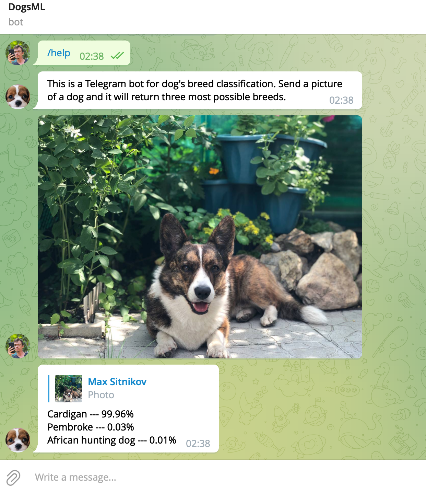

## Machine Learning pet project.

#### Various implementation of the neural nets:
 - Simple naive versions built with numpy - [source](https://github.com/Kekc/dogsML/blob/main/dogsml/simple/hidden_layer.py)
 - Basic Tensorflow version - [source](https://github.com/Kekc/dogsML/blob/main/dogsml/tfbased/tf_model.py)
 - Convolutional neural net - [source](https://github.com/Kekc/dogsML/blob/main/dogsml/tfbased/convolutional.py)
 - Transfer learning with Tensorflow MobileNet - [source](https://github.com/Kekc/dogsML/blob/main/dogsml/transfer/dog_breeds.py)
 - Utils to create data pipelines and to use saved tensorflow models
---

#### Dog's Breed classification model

Model Architecture: Transfer learning with `Tensorflow.MobileNetV3Large` neural net.
Dataset: [Stanford Dogs Dataset](http://vision.stanford.edu/aditya86/ImageNetDogs/)  

The most accurate model achieved 77% validation accuracy:  
 - [Model source](https://github.com/Kekc/dogsML/blob/main/dogsml/colab/dog_breeds_77.ipynb)  
 - [Google colab](https://colab.research.google.com/github/Kekc/dogsML/blob/main/dogsml/colab/dog_breeds_77.ipynb)  
 - Model is deployed via the [Telegram Bot](https://t.me/dogsml_bot)
 

---

#### Used datasets:
- http://vision.stanford.edu/aditya86/ImageNetDogs/
- https://www.kaggle.com/datasets/prasunroy/natural-images
- https://www.kaggle.com/datasets/jessicali9530/stanford-dogs-dataset

Inspired by:
https://www.coursera.org/specializations/deep-learning

***
Run ` pip install -e .` in the ROOT folder for the local development
